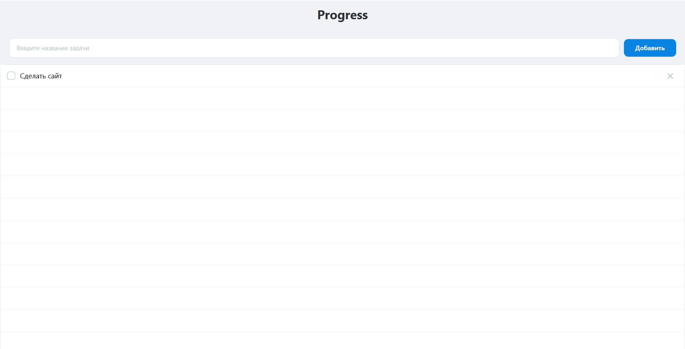

# Progress
Простой трекер задач на JavaFX с сохранением задач в JSON.

## Функции
- Добавление задач
- Отметка о выполнении
- Удаление задач
- Автоматическое сохранение в JSON

## Стек
- Java 25
- JavaFX
- JSON

## Скриншоты


## Запуск
1. Клонирование репозитория
```bash
git clone https://github.com/alexeikudinov15/Progress.git
```

2. Открытие проекта в IntelliJ IDEA как Maven проект.

3. Запуск приложения через класс `Application.java` или `Launcher.java`
